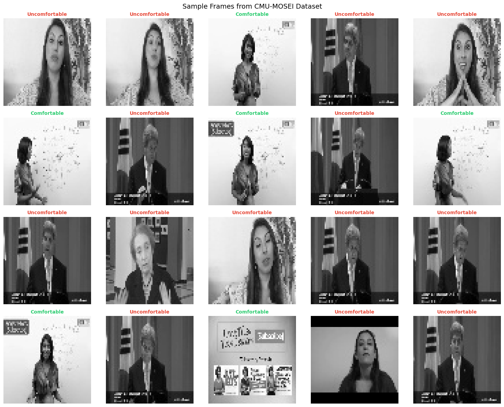
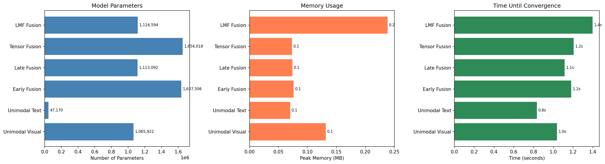
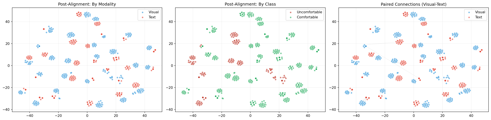
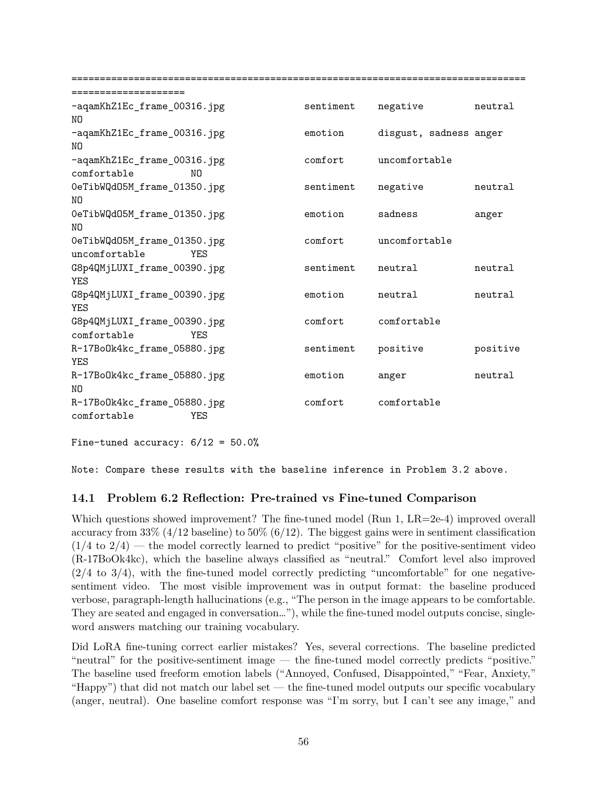
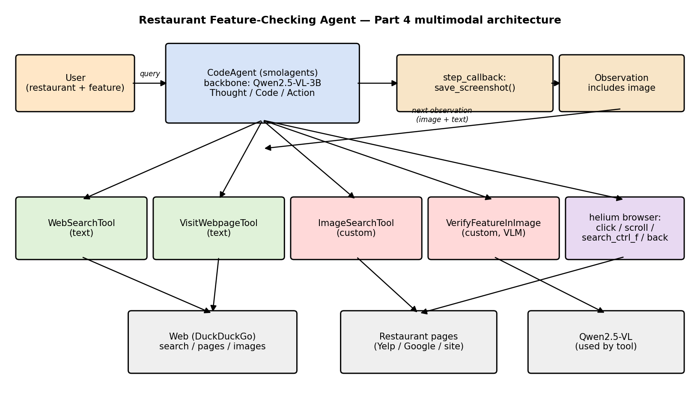
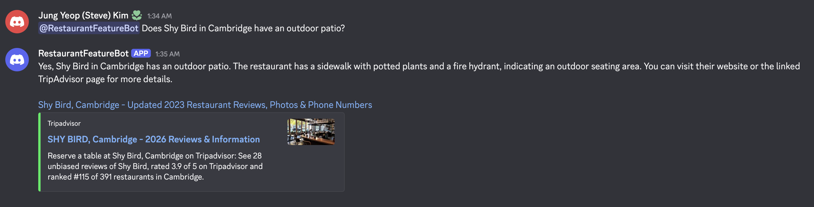
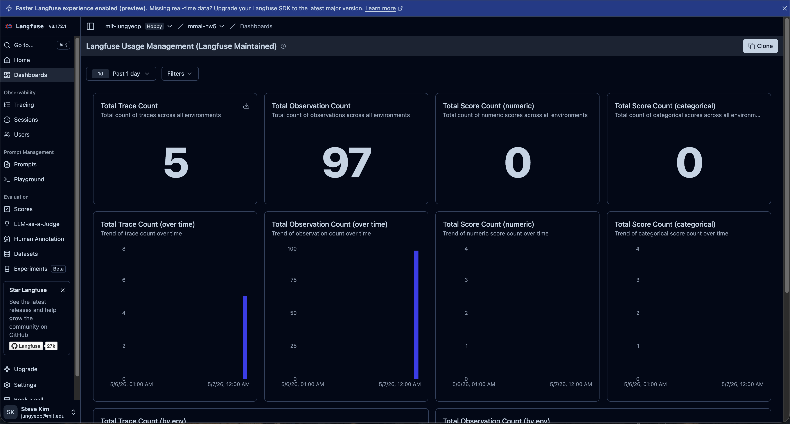

# Multimodal AI — Course Portfolio

**MAS.S60 / 6.S985 · MIT · Spring 2026**
**Author:** Jungyeop (`jungyeop@mit.edu`)

This repository is my living lab notebook for the *Multimodal AI* class: five homework
assignments plus the final project, all developed around a single threaded idea —
**predicting how comfortable a person appears in a video** — and progressively
layered with new techniques each week.

I picked one task and one dataset (CMU-MOSEI, binary
*Comfortable* vs *Uncomfortable*) and carried it through every homework so I could
watch the same problem under increasingly capable models: raw modality extraction
→ fusion & alignment → vision-language fine-tuning → reinforcement learning →
agentic behavior. The result is a portfolio that reads as a continuous story
rather than five disconnected exercises.

---

## Highlights

<table>
<tr>
<td width="50%"><br/><b>HW1 — CMU-MOSEI ingestion.</b> Frames sampled at 1 fps from the 20 video segments I pulled with <code>yt-dlp</code>, downsampled to 64×64 grayscale for the visual modality.</td>
<td width="50%"><br/><b>HW2 — Fusion shootout on AV-MNIST.</b> Final test accuracy for early / late / tensor / low-rank tensor (LMF) fusion. Tensor wins on raw accuracy; LMF wins on accuracy-per-parameter.</td>
</tr>
<tr>
<td width="50%"><br/><b>HW2 — Align-before-fuse.</b> Adding a contrastive pre-alignment stage in front of the fusion head measurably improves both convergence and top-line accuracy.</td>
<td width="50%"><br/><b>HW3 — LoRA fine-tuning of Qwen2.5-VL.</b> Held-out accuracy jumped from 33% (4/12, baseline) to 50% (6/12, LoRA @ LR=2e-4). The fine-tuned model also stopped hallucinating freeform emotion labels.</td>
</tr>
<tr>
<td width="50%"><br/><b>HW4 — GRPO-trained model in action.</b> After GRPO post-training, the model reliably produces chain-of-thought + a single-word answer in the trained format. 100% format compliance on the held-out probes.</td>
<td width="50%"><br/><b>HW5 — Agent architecture.</b> smolagents <code>CodeAgent</code> wrapping a vision-language backbone, with tools for frame fetching, comfort classification (the HW3/HW4 adapter), and Discord output.</td>
</tr>
<tr>
<td width="50%"><br/><b>HW5 — Agent in the class Discord.</b> Goal-directed responses with proper <code>@</code>-mention hydration (see <a href="hw5/utils.py"><code>hw5/utils.py</code></a>).</td>
<td width="50%"><br/><b>HW5 — Observability with Langfuse.</b> Every tool call, prompt, latency, and cost is logged so any run can be re-scored offline.</td>
</tr>
</table>

---

## Repository layout

```
.
├── hw1/   Multimodal data preprocessing — CMU-MOSEI ingestion + modality extraction
├── hw2/   Fusion & alignment — AV-MNIST, early/late/tensor/LMF fusion, contrastive
├── hw3/   Multimodal LLMs — Qwen2.5-VL LoRA fine-tuning on my comfort task
├── hw4/   GRPO for VLMs — RL-tuning the HW3 model with rule-based rewards
├── hw5/   AI Agents in the Wild — smolagents + vision + Discord + Langfuse traces
├── final-project/   (in progress — see folder README)
└── README.md
```

Large artifacts (the 30 GB CMU-MOSEI dump, 8 GB MultiBench checkout, LoRA / GRPO
adapters, `.venv`s) are not tracked — see `.gitignore`. Each homework README lists
exactly what to re-download to reproduce.

---

## The assignments at a glance

| # | Topic | What I built | Key artifact |
|---|---|---|---|
| 1 | Data preprocessing | Hand-built CMU-MOSEI pipeline: 20 videos → frames + GloVe text + COVAREP audio, all aligned to segment-level labels | [hw1/assets/sample_frames.png](hw1/assets/sample_frames.png) |
| 2 | Fusion & alignment | AV-MNIST with early / late / tensor / LMF fusion + contrastive alignment study | [hw2/assets/fusion_comparison_bars.png](hw2/assets/fusion_comparison_bars.png) |
| 3 | Multimodal LLMs | LoRA fine-tune of Qwen2.5-VL on my comfort task; LR sweep (2e-4 vs 5e-4); baseline 33% → 50% on held-out | [hw3/assets/lora_comparison.png](hw3/assets/lora_comparison.png) |
| 4 | GRPO / RL | Implemented GRPO advantage from scratch, trained the HW3 adapter further with rule-based rewards | [hw4/assets/grpo_eval_example.png](hw4/assets/grpo_eval_example.png) |
| 5 | AI Agents | smolagents-based vision agent, Discord integration, Langfuse traces, online eval | [hw5/assets/discord_interaction.png](hw5/assets/discord_interaction.png) |

Each `hwN/` folder has its own README that gives the full context, results,
and reproduction notes for that assignment.

---

## Through-line: the comfort-prediction task

I committed to one concrete task in HW1 and never changed it. The thread:

- **HW1** — frame the problem, ingest CMU-MOSEI, define *Comfortable* vs
  *Uncomfortable* from sentiment polarity, extract three modalities.
- **HW2** — try AV-MNIST as a controlled fusion playground; reason about which
  fusion strategy would best suit my real task.
- **HW3** — build a VLM-style image+text instruction dataset from CMU-MOSEI
  frames, fine-tune Qwen2.5-VL with LoRA, sweep learning rate.
- **HW4** — keep the same Qwen2.5-VL LoRA, post-train with GRPO using a binary
  correctness reward, compare against SFT-only.
- **HW5** — wrap the same model into a goal-directed agent, give it tools, log
  every trace in Langfuse, and let it interact in the class Discord.

The final project will likely extend HW5: a multimodal agent that does the
comfort-sensing in a loop with a human, exposed through a richer interface.

---

## Running things

- Each homework was originally executed on Colab Pro / A100. Where I ran locally
  on RTX hardware, the per-hw README notes that.
- Datasets and trained weights live outside git; see each homework's README for
  download/regenerate instructions.
- Python environments are pinned per-homework inside `hwN/.venv/` (gitignored).

---

## Course context

> *"This repository should bring everything together in one place: past
> assignments, ongoing explorations, and final projects. […] A well-crafted
> repository tells the story of how you think, what you've explored, and how
> your ideas evolve."*
> — course handout, repo requirement (20 pts)

I'm using this repo as my technical lab notebook for the semester. Diagrams and
images live alongside each notebook in `hwN/assets/` so the visual story
survives even when the data and weights don't.
