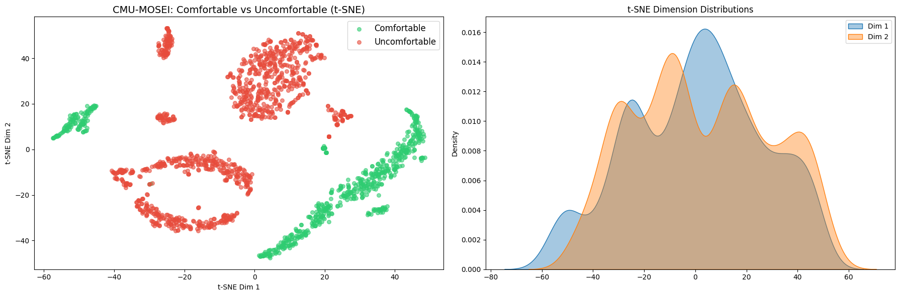
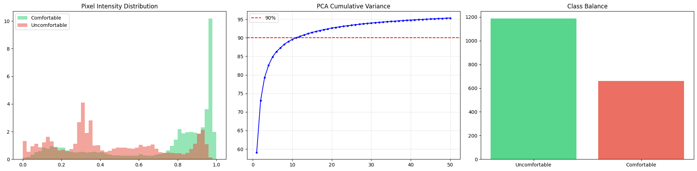

# HW1 — Multimodal Data Preprocessing

**Notebook:** [mmai_HW1.ipynb](mmai_HW1.ipynb) · **Writeup:** [mmai_HW1.pdf](mmai_HW1.pdf)

## Task

Binary classification: predict whether a person in a video appears
**Comfortable** or **Uncomfortable**. Mapping from CMU-MOSEI sentiment scores:
positive sentiment → Comfortable, negative → Uncomfortable.

## Dataset

**CMU-MOSEI**, 26 videos (originally targeted 20, expanded to 26 after iterating
through ~30 IDs since many YouTube videos have been deleted since 2018).
Class balance: 19 Comfortable vs 7 Uncomfortable at the video level (~70/30),
~56/44 at the frame level (Uncomfortable videos are longer).

## Modalities extracted

| Modality | Representation |
|---|---|
| Visual | 1 fps frames, 64×64 grayscale, flattened to 4,096-d |
| Text | Per-video mean of 300-d GloVe word vectors |

Audio (COVAREP) was available via the SDK but **not used** — the file size
(~11 GB) was too large to justify for HW1.

## Visuals

| | |
|---|---|
|  |  |
| Sampled frames | Class balance after sentiment→comfort mapping |

*t-SNE of the feature vectors. Clusters reflect speaker identity more than
sentiment — a motivation for moving beyond raw pixels in later homeworks.*

## Reproducing

The 30 GB `cmumosei_data/` H5 dump, 388 MB `cmumosei_videos/`, and the
`MultiBench/` clone are **gitignored**. To rebuild:

1. Clone the CMU-Multimodal SDK and the CMU-MOSEI standard fold from
   `https://github.com/CMU-MultiComp-Lab/CMU-MultimodalSDK`.
2. Run the download cells in the notebook (uses `yt-dlp`).
3. Run the frame-extraction loop.
