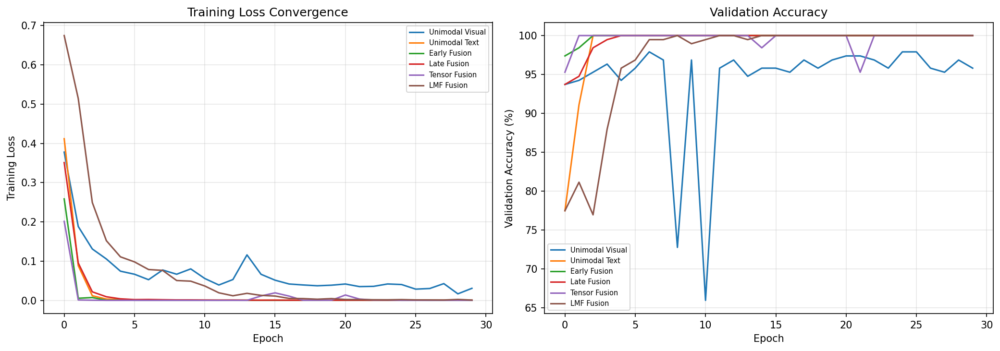

# HW2 — Multimodal Fusion & Alignment

**Notebook:** [Homework_2_Multimodal_Fusion_and_Alignment.ipynb](Homework_2_Multimodal_Fusion_and_Alignment.ipynb) · **Writeup:** [Homework_2_Multimodal_Fusion_and_Alignment.pdf](Homework_2_Multimodal_Fusion_and_Alignment.pdf)
**Earlier draft:** [Homework_2_Multimodal_Fusion_and_Alignment_v1.ipynb](Homework_2_Multimodal_Fusion_and_Alignment_v1.ipynb)

## Part 1 — Reading reflection

Six questions on *align-before-fuse* (Li et al., 2021) and the *Platonic
Representation Hypothesis* (Huh et al., 2024), discussed in the context of the
HW1 comfort task.

## Part 2 — Hands-on

| Problem | Points | What |
|---|---|---|
| 1 | 5 | Tensor exercises |
| 2 | 5 | Einsum exercises |
| 3 | 10 | Unimodal baselines on AV-MNIST (audio + image) |
| 4 | 10 | Early-fusion baseline on AV-MNIST |
| 5 | 30 | Implement Early / Late / Tensor / LMF fusion on the HW1 dataset |
| 6 | 30 | Contrastive learning on the HW1 dataset |
| 7 | 10 | Reflection |

## Results on the HW1 dataset

| Model | Test Acc | Parameters |
|---|---|---|
| Unimodal Visual | 93.78% | 1.07 M |
| Unimodal Text | 100.00% | 47 K |
| Early Fusion | 100.00% | 1.64 M |
| Late Fusion | 100.00% | 1.11 M |
| Tensor Fusion | 100.00% | 1.65 M |
| LMF Fusion | 100.00% | 1.12 M |

The text-only model already hits 100% because the dataset has only 26 unique
videos and the text features are per-video GloVe averages (one unique
embedding per video). Every fusion variant therefore also reaches 100% — the
interesting axes of comparison become parameter count, memory, and time.

## Contrastive learning result

Mean cosine similarity: 0.72 (paired) vs 0.71 (unpaired). The 0.012 gap is
small for the same reason as above — many frames in the batch share the same
text embedding, so contrastive learning has a hard time creating clean
positive/negative pairs.

## Figures

*Final test accuracy by fusion strategy.*

*Training curves across fusion strategies.*

*Post-alignment visualization.*

## Reproducing

AV-MNIST and the `MultiBench/` clone are pulled by the notebook and are
gitignored.
