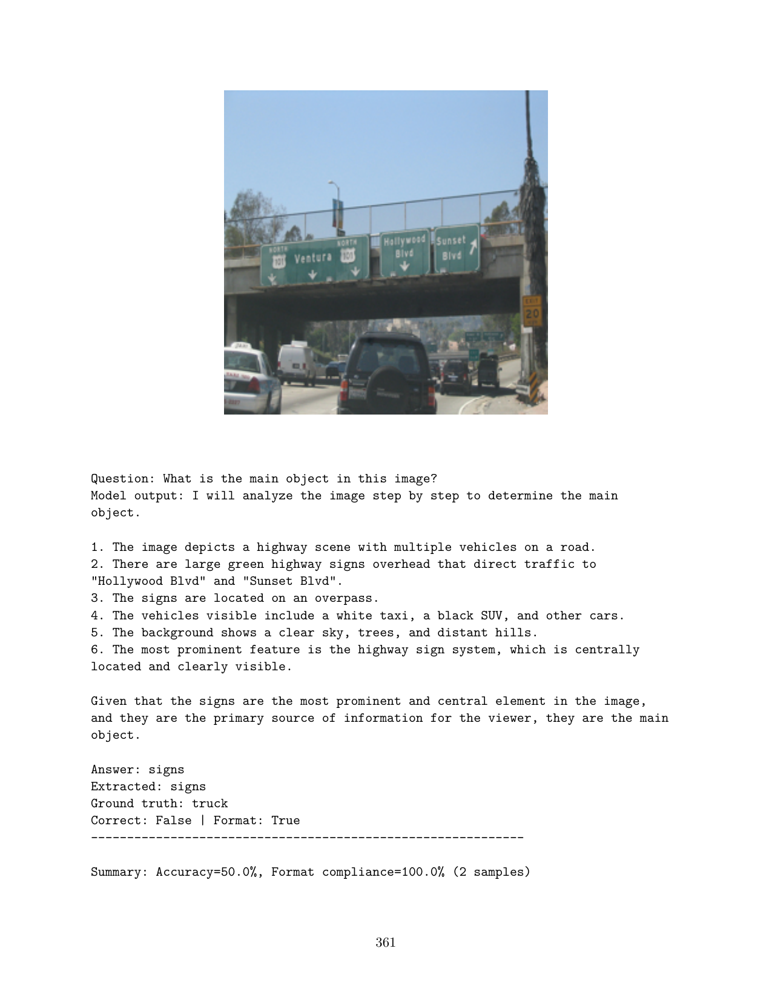

# HW4 — GRPO for Vision-Language Models

**Notebook:** [Homework_4_GRPO_VLMs.ipynb](Homework_4_GRPO_VLMs.ipynb)
**Writeup:** [Homework_4_GRPO_VLMs.pdf](Homework_4_GRPO_VLMs.pdf)

---

## What this homework is about

Reinforcement-learn the HW3 model with **Group Relative Policy Optimization**
(GRPO, DeepSeekMath 2024). The pitch: PPO needs a learned critic, which doubles
memory and adds another training instability. GRPO replaces the critic with a
per-prompt group baseline — sample G completions per prompt, advantage is
`(reward − group_mean) / group_std`. Cheaper, simpler, and works well when you
have a cheap rule-based reward (which I do: "did the binary comfort label
match?").

## Problems

| Problem | Points | What |
|---|---|---|
| 1 | — | GPU verification + secret word |
| 2 | 10 | Prepare the dataset (mostly reuse of HW3's `mmai-data/`) |
| 3 | 15 | **Conceptual**: walk through GRPO step-by-step in writing |
| 4 | 25 | **Implementation**: write the GRPO advantage computation from scratch (with response masking) |
| 5 | 15 | Design reward functions |
| 6 | 10 | Build the training-rollout dataset |
| 7 | 20 | Train with GRPO on top of the HW3 LoRA adapter |
| 8 | 20 | Post-training evaluation on held-out frames |

## Reading reflection (Part 1)

Three questions, summarized:

1. **GRPO vs PPO** — GRPO drops the value function, uses a group of G sampled
   responses as the baseline. Tradeoffs: lower memory + simpler training, but
   higher-variance advantage when G is small or rewards collapse to a constant
   inside a group.
2. **Reward design** — learned reward models are flexible but reward-hackable;
   rule-based rewards (e.g., "matches ground truth") are robust but only as
   good as your label and only work where the answer is checkable.
3. **SFT vs GRPO** — SFT trains the model to *imitate* good completions; GRPO
   trains it to *prefer* the better one among several samples. Different
   loss surfaces, different failure modes.

## The advantage computation (Problem 4) in one paragraph

Given a batch of `B × G` rollouts (B prompts, G completions each) with
per-rollout rewards `r ∈ R^{B·G}` and a token-level response mask:

1. Reshape rewards to `(B, G)`, compute per-group mean and std.
2. Advantage of rollout `(b,g)` = `(r[b,g] − mean[b]) / (std[b] + ε)`.
3. Flatten back to `(B·G,)`, then broadcast each scalar advantage across the
   response length and zero out prompt tokens with the mask.

That's the entire signal that drives the GRPO clipped-surrogate loss.

## Headline result


*Held-out probe after GRPO training. The model produces a numbered
chain-of-thought and ends with `Answer: <word>` exactly as trained.
**Format compliance: 100% / Accuracy: 50%** on the small held-out set (the test
probes use COCO images while training was on `mmai-data/` — domain shift is
the main reason accuracy isn't higher).*

## Training artifacts

[`grpo-output/`](grpo-output/) holds the trained LoRA adapter and the rollout
completions logged during training. **Gitignored** — it's ~120 MB. Inside:

```
grpo-output/
├── adapter_config.json + adapter_model.safetensors   ← the trained LoRA
├── chat_template.jinja, processor_config.json, tokenizer*  ← processor state
├── training_args.bin
├── checkpoint-100/                                   ← mid-training snapshot
└── completions/                                      ← rollouts for inspection
```

## Reproducing

- Starts from the HW3 LoRA adapter (`hw3/qwen2_5_vl_lora_best`).
- Reuses [`hw3/mmai-data/`](../hw3/mmai-data/) as the prompt source.
- Train on an A100 — Problems 7 and 8 are the GPU-heavy ones.
